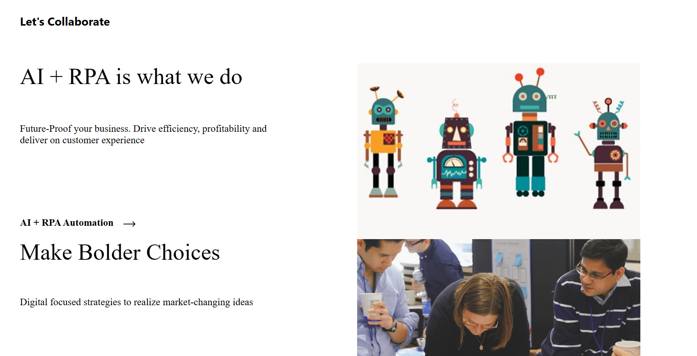
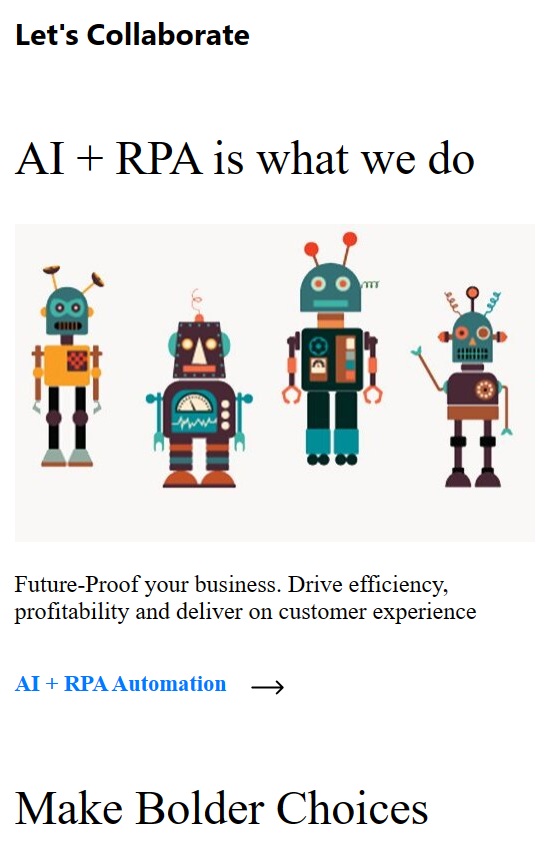

# Let's-collaborate assignment from XivTech in React

In this assignment, I have to create a clone of the "Let's Collaborate" component from https://www.xivtech.io. This includes creating the List component for Let's Collaborate including the below child card components.

-   AI + RPA is what we do
-   Make Bolder Choices
-   Innovate with speed
-   Embrace Cloud

## Table of contents

-   [Overview](#overview)
    -   [The Theme](#the-theme)
    -   [Screenshot](#screenshot)
    -   [Links](#links)
-   [My process](#my-process)
    -   [Built with](#built-with)
    -   [What I learned](#what-i-learned)
    -   [Useful resources](#useful-resources)
-   [Author](#author)

## Overview

### The Theme

-   The deliverable should include the full-size layout as well as the mobile layout.
-   Have a scroll effect and other effects and animations.

### Screenshot

| Desktop View                                                                | Mobile View                                                               |
| --------------------------------------------------------------------------- | ------------------------------------------------------------------------- |
|  |  |

### Links

-   [Github Solution](https://github.com/ShivamManiMaurya/Lets-collaborate-from-XivTech-assignment)
-   [Live Site](https://boisterous-clafoutis-910241.netlify.app/)

## My process

### Built with

-   HTML5
-   CSS custom properties
-   Flexbox
-   JavaScript
-   [React](https://reactjs.org/) - JS library
-   React intersection observer

### What I learned

-   Introduced with React intersection observer
-   Get more familiar with transition and transform CSS property
-   Get more familiar with animations in CSS
-   Get more familiar with Flexbox
-   Get more familiar with media query

### Useful resources

-   [Colby Fayock](https://www.youtube.com/@colbyfayock) - A special thanks to Colby Fayock for helping me in understanding the react intersection observer.

## Author

-   Website - [Shivam Maurya](https://shivammanimaurya.github.io/my_portfolio_website/)
-   GitHub Page - [Shivam Maurya GitHub](https://github.com/ShivamManiMaurya)
-   Linkedin - [@shivammanimaurya](https://www.linkedin.com/in/shivammanimaurya)
